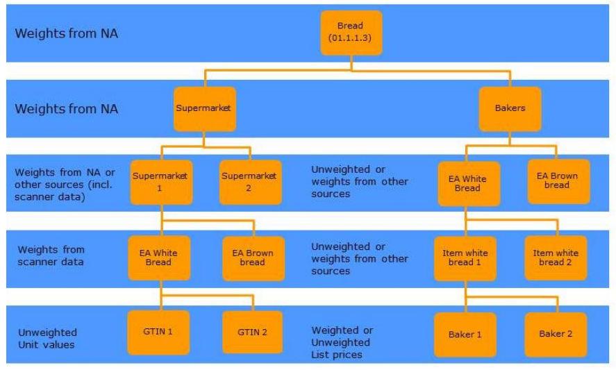
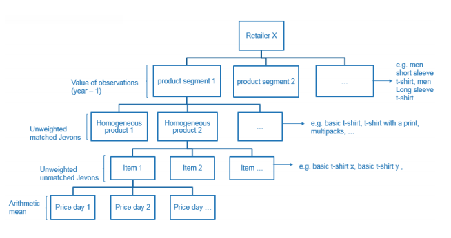
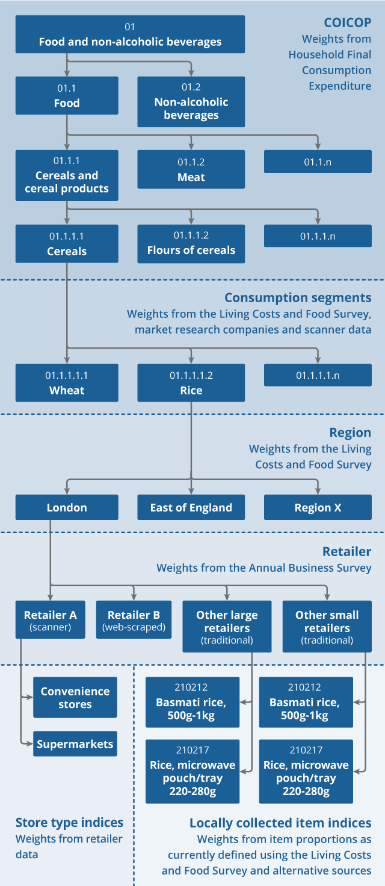
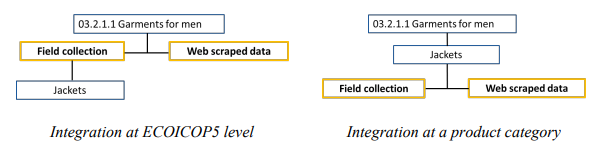

This page contains information on how alternative data sources can be aggregated with existing data sources\

**Page information**

+---------------------+--------------------------------------------------------------------------------------------+
| Version             | v2                                                                                         |
+---------------------+--------------------------------------------------------------------------------------------+
| Last updated on     | 2022-01-17                                                                                 |
+---------------------+--------------------------------------------------------------------------------------------+
| Summary of changes  | Initial publication version                                                                |
+---------------------+--------------------------------------------------------------------------------------------+
| Page History        | [See here](https://unstats.un.org/wiki/pages/viewpreviousversions.action?pageId=240910507) |
+---------------------+--------------------------------------------------------------------------------------------+

------------------------------------------------------------------------

# Overview of aggregation approaches {#Aggregation-Overviewofaggregationapproaches}

Integration of alternative data sources into the CPI production system can require changes in several aspects. The degree of such changes will rely on factors such as the characteristics of the data source to be implemented, the approach adopted (targeted or bulk use of the data), the peculiarities of the classification/aggregation system used to compile the CPIs at different levels and the availability of weight sources for the creation and refinement of the different CPI aggregates.

As an example, incorporation of a targeted approach that aims to replace the traditional collection of a sample of products with a similar sample taken from the alternative data source may require fewer or no changes. In contrast, more fundamental changes to the amount of data will usually need changes to the aggregation system as well, such as an update in the classification structure of the CPI.

In this regard, the integration of alternative data sources in the CPI aggregation structure may involve the creation of new retailer-specific elementary aggregates (EA). Elementary aggregates represent the lowest level -- both in the product and the geography dimensions -- where price indices are first calculated using prices for defined products. The section [Aggregation across time and outlets](https://unstats.un.org/wiki/display/GWGSD/Aggregation+across+time+and+outlets) defines how individual price quotes may need to be aggregated to calculate price quotes for defined products in view of the frequency of the CPI.

Once calculated, the Eurostat's guidelines "[Practical Guide on Multilateral Methods in the HICP](https://ec.europa.eu/eurostat/documents/3859598/14503841/KS-GQ-21-020-EN-N.pdf)" (chapter 6) and \"[Practical guidelines on web scraping for the HICP](https://ec.europa.eu/eurostat/documents/272892/12032198/Guidelines-web-scraping-HICP-11-2020.pdf/)\" (p. 18) discusses the integration of these elementary aggregates into the CPI aggregation structure. It has been discussed in the Eurostat\'s \"Practical guidelines on web scraping for the HICP\" that the creation of the aggregates for the type of data sources at different levels of the classification structure can impact the potential use of the data sets. There are different experiences reported in the literature on how the CPI classification structure can be modified in order to incorporate such new aggregates. A summary of some of these approaches are described below.

One option is to introduce a new aggregation level corresponding to the types of data sources (for example, scanner data, web scraped data, field collection, administrative data, or other) just below the lowest level of the CPI commodity classification structure for which CPI basket weights are available (typically 5-digits European COICOP classes). This new aggregation level is between the lowest European COICOP level and any national refinement classes used for product categories; see Figures 1a and 1b of the illustrative examples below. This option has been discussed in Statistics Belgium ([Redefining what products are in the context of scanner data and web scraping, experiences from Belgium](https://eventos.fgv.br/sites/eventos.fgv.br/files/arquivos/u161/ottawa_-_belgium_-_ken_vl_0.pdf)) and in the Eurostat\'s HICP - [Practical Guide for Processing Supermarket Scanner Data](https://circabc.europa.eu/ui/group/7b031f10-ac19-4da3-a36f-58708a70133d/library/8e1333df-ca16-40fc-bc6a-1ce1be37247c/details) and is referred to as \"integration at ECOICOP5 level\".

Another option is to introduce the data source types under any national refinement classes used for product categories below the 5-digits European COICOP classes; see Figure 1c of the illustrative diagram below for a case example that has been considered by the Office for National Statistics (ONS) ([Introducing alternative data into consumer price statistics: aggregation and weights](https://www.ons.gov.uk/economy/inflationandpriceindices/articles/introducingalternativedataintoconsumerpricestatisticsaggregationandweights/2021-11-09#proposed-aggregation-structure)). This has been discussed in the Eurostat\'s Practical guidelines on web scraping for the HICP where it is referred to as \"integration at a product category\". Note that a geographical breakdown is also considered in Figure 1c before the aggregates for the sources are introduced. 

Whatever option is chosen, product categories can then be defined for each type of data source, and even for each retailer within a data source type. Figure 1c shows an example of these product categories, identified here as \"consumption segments\". This structure allows consumption segments to be adapted to the data source type or to the retailer, depending on their product range. A price index can be calculated for each retailer and for each type of data source for the lowest level classes of the COICOP classification. The indices for all types of data sources are then aggregated to obtain the price index for the lowest level commodity class; retailer or data source type weights may be needed at this stage. An important consideration here is the level at which the indices are published. If they are currently published below COICOP5, it may be necessary to ensure that the same consumption segments are used for all data sources and those consumption segments define the level at which indices are published (see Figure 1c below).

A simplified view summarizing the approaches presented above can be seen in Figure 1d. Figure 1d illustrates two different possibilities of creation of such aggregates at the ECOICOP 5 or at the products level. The former is more appropriate for the bulk use of alternative data sources as it allows a broader and more extensive use of the data sets as all the products within this category could be considered. For integration at the product level, only this kind of classification structure could be considered.

In addition, since the alternative data sources contain prices for a large number of individual products, potentially covering all geographical regions of the country, a classification level corresponding to regions can be introduced and used in the index calculation, so that the relative importance of regions are explicitly taken into account in the national index calculation. A by-product of this allows for the possibility of regional indices to be calculated as an additional output.

Next we discuss the weights required to aggregate indices within the same type of data source and across different types of data source.

# Weights for aggregation within the same type of data source {#Aggregation-Weightsforaggregationwithinthesametypeofdatasource}

For the aggregation of indices based on scanner data, total sales information available in scanner data for each individual product can be used to estimate weights for the product categories. First, retailer-specific elementary indices based on multilateral index methods can be calculated using data from each scanner data retailer. For example, some retailers may have different types of stores such as convenience to larger supermarkets (see Figure 1c). Elementary indices can be stratified by this outlet type (see [Aggregation across time and outlets](https://unstats.un.org/wiki/display/GWGSD/Aggregation+across+time+and+outlets)). Second, the retailer-specific elementary indices can then be aggregated to obtain elementary indices using a weighted arithmetic average. For a given scanner data retailer, total sales for products that belong to a product category and a geography (and outlet type, if chosen) in a given month can be used as weight for that retailer in that month in the aggregation of retailer-specific elementary indices into a scanner data elementary index for the considered product category.

For the aggregation of indices based on web scraped data, due to the lack of total sales data, we may only rely on market shares derived from retail trade surveys or administrative data to aggregate retailer-specific elementary indices into elementary indices based on web scraped data.

# Weights for aggregation across different types of data source {#Aggregation-Weightsforaggregationacrossdifferenttypesofdatasource}

Another key point is that weights are needed for the different types of data sources to aggregate data source type-specific elementary indices into higher level price indices (see Figures 1a, 1b and 1c). For example, if field collection data and scanner data are to be aggregated for a consumption segment, we need to estimate the market shares of the retailers covered by the scanner data index as well as the market shares of all retailers represented by the field collection data. If the field collection is based on a sample of retailers, the market share of the entire subpopulation of which the sample is representative needs to be estimated.

Typically, NSOs have to aggregate price indices based on scanner data, web scraped data and field collected data for a given product category. They need to identify relevant data sources for the estimation of data sources\' market shares for each product category. Among the possible data sources for the market share estimation, retail trade surveys may be useful. This type of survey has the potential to provide regional data. The commodity categories for which sales data are estimated from retail surveys may be higher than the published CPI goods and services categories. In this case, other data sources such as scanner data or third-party estimates may be used to redistribute sales estimates to lower level product categories. The business register may also provide some general information on retailers\' operations, but generally it gives the total revenue for each retailer operating in the country. There may be no geographic or commodity breakdown of the revenue data, which does not make the business register a suitable data source for this weighting issue. In some cases, useful administrative data may be available from a third-party data provider. In all cases, NSOs need to assess the data quality, the coverage as well as the relevance of the various data sources available to ensure good quality weight estimates. 

# Illustrative examples {#Aggregation-Illustrativeexamples}

Figure 1: Illustrative examples of the integration of new and traditional data sources

(a): Illustration of the creation of different aggregates below the ECOICOP5 level for the incorporation of different data sources. Source: Eurostat: HICP - [Practical Guide for Processing Supermarket Scanner Data](https://circabc.europa.eu/ui/group/7b031f10-ac19-4da3-a36f-58708a70133d/library/8e1333df-ca16-40fc-bc6a-1ce1be37247c/details) (2017, p. 31).

\*Note: NA here refers to data from the National Accounts (generally Household Final Consumption Expenditure referred to in Figure 1c).

(b): Possible refinement of the aggregates below the retailer aggregate. Source: Statistics Belgium, [Redefining what products are in the context of scanner data and web scraping](https://eventos.fgv.br/sites/eventos.fgv.br/files/arquivos/u161/ottawa_-_belgium_-_ken_vl_0.pdf), experiences from Belgium (p. 8).

(c): Illustration of the creation of aggregates at the product level (referred to here as consumption segments). Note also the addition of the geographical breakdown in the process. Source: [ONS (UK), Introducing alternative data into consumer price statistics: aggregation and weights](https://www.ons.gov.uk/economy/inflationandpriceindices/articles/introducingalternativedataintoconsumerpricestatisticsaggregationandweights/2021-11-09#proposed-aggregation-structure)

(d): Illustration of integration of alternative data sources at different levels of the classification structure. Source: Eurostat: [Practical guidelines on web scraping for the HICP](https://ec.europa.eu/eurostat/documents/272892/12032198/Guidelines-web-scraping-HICP-11-2020.pdf/) (2020, p. 18),

