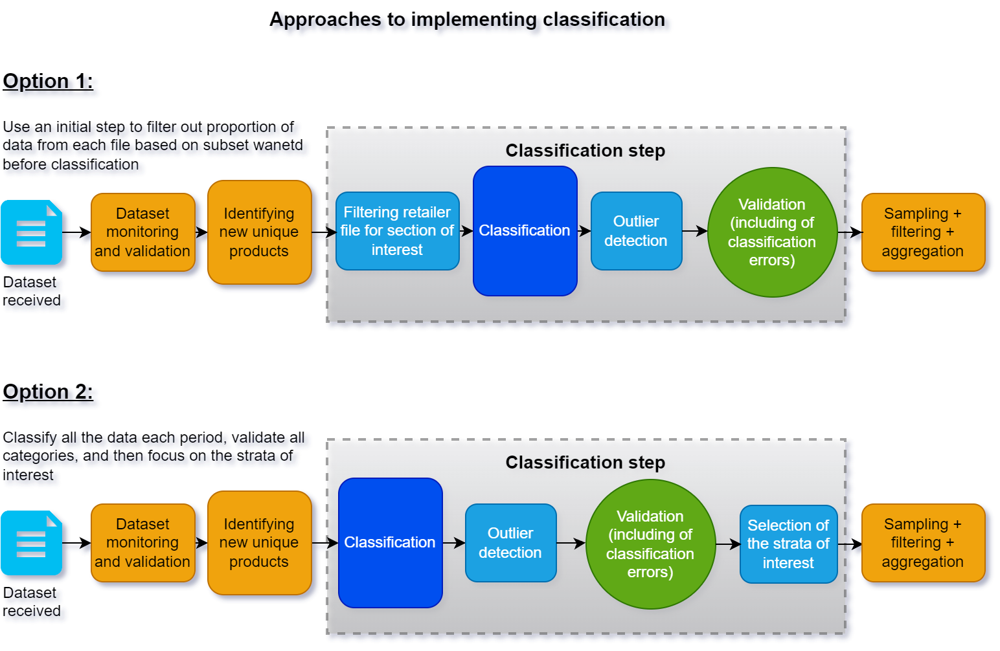

This section provides context about where and how the classification
step fits into the rest of the pipeline processing alternative data to
create elementary price indices, as well as some important
considerations and options when setting up the classification process.
This article can also be seen as a companion to the [pre-conditions to
classification](pre-conditions-and-deciding-on-appropriate-classification-methods.qmd) section,
helping the NSO design the operational process for the individual or
blended method that will be chosen.\

------------------------------------------------------------------------

# Pre-classification: identify unique products {#Designingtheclassificationstepoperationalconsiderations-Pre-classificationidentifyuniqueproducts}

As mentioned in the pre-conditions to classification section, the
classification step should be done at the [unique product
level](pre-conditions-and-deciding-on-appropriate-classification-methods.qmd),
which significantly reduces the scale and complexity of the task. Two
approaches to classification are possible to consider:

1.  NSOs may choose to do classification at the individual product level
    at the granularity of an [article code (such as
    GTIN)](https://unstats.un.org/wiki/spaces/GWGSD/pages/87429362/ARCHIVE+Glossary),
    or
2.  NSOs may choose to classify a higher granularity record (such as a
    [homogeneous unique
    product](https://unstats.un.org/wiki/spaces/GWGSD/pages/87429375/ARCHIVE+Identifying+unique+products)).

Classifying using the second case will reduce the scale of the
clasification task, however NSOs may wish to use the predicted product
class as input for grouping/linking performed as part of the
\'aggregation-across-products\' activity (1). It is worth recognizing
that misclassification is more likely to impact the latter as product
grouping/linking would thus omit products misclassified to other
categories. 

# The classification step is a composition of several sub-steps {#Designingtheclassificationstepoperationalconsiderations-Theclassificationstepisacompositionofseveralsub-steps}

## Filtering out aspects of a retailer file not necessary {#Designingtheclassificationstepoperationalconsiderations-Filteringoutaspectsofaretailerfilenotnecessary}

While NSOs approach alternative data with goals of using all the data
for price indices, the [alternative data received may not fully
align](method-2-pattern-matching-classification-method.qmd) with the set of elementary aggregates that will
be calculated with this dataset. Specifically:

- There may be aspects of the alternative dataset provided that may not
  fall into the scope of the CPI or be desirable for production. This
  could include cases such as the volume of data for the specific strata
  is just too small to be meaningful and representative. Alternatively,
  there may be a case where specific aspects of the provided dataset are
  not of interest or needed for the CPI. (2) 
- Where the NSO is following a [gradual adoption
  strategy](https://unstats.un.org/wiki/spaces/GWGSD/pages/95911991/ARCHIVE+Selection+of+categories)
  of this dataset for production, and hence the proportion of the
  retailer dataset used for production expands over time.

In these cases, it may be useful to select an approach where the data is
cleanly stratified to allow the NSO to focus on the proportion of
interest. In this case, the NSO has two approaches that can be adopted
(see Figure 1 for visual):

- **Option 1**: The NSO may set up a two pronged 'classification'
  approach, whereby the 'out-of-scope' data within each file is first
  filtered out, and only the 'in-scope' data is classified further to
  the categoires of interest. This approach may be preferred if the
  filtering can be done in a very robust and stable way, such as with
  [Method 1](method-1-attribute-based-classification-method.qmd) or [Method 2](method-2-pattern-matching-classification-method.qmd), and in
  essence acts as a separate simpler classifier that precedes the main
  classifier that actually supports production needs.
- **Option 2**: the NSO may aim to classify all the data in the dataset
  using one classifier, aiming instead to only use categories that are
  needed afterwards. This approach may be preferred either if the data
  does not allow a clean way to filter out data points (say method 1 or
  2 cannot be reliably used), or if the in-scope and out-of-scope
  categories will shift over time (such as due to the NSO following a
  gradual implementation strategy for the retailer dataset). The latter
  may be the chosen approach simply because it is simpler to maintain
  and update one classifier rather than two.

Diagram 1: Approaches to implementing classification in production

More specific consideration of both options can be seen here:

+----------------------+----------------------+----------------------+
| Option               | Pros                 | Cons                 |
+----------------------+----------------------+----------------------+
| **Option 1**: use a  | - This approach      | - This approach      |
| filter stage         |   would result in a  |   means that the NSO |
| preceding the main   |   stable and cleaner |   needs to maintain  |
| classification stage |   set of data that   |   both filtering and |
|                      |   may need to be     |   classification     |
|                      |   classified by the  |   sub-steps together |
|                      |   actual production  |   and be mindful of  |
|                      |   classifier, which  |   the decline of     |
|                      |   could make the     |   performance of the |
|                      |   task of creating   |   actual classifier  |
|                      |   the production     |   if the filtering   |
|                      |   classifier         |   sub-step were to   |
|                      |   slightly simpler.  |   fail.              |
|                      | - This may also      |   Specifically, the  |
|                      |   target NSO         |   classifier may     |
|                      |   resources          |   fail or perform    |
|                      |   validating         |   poorly as it may   |
|                      |   classification     |   suddenly not see   |
|                      |   output to only     |   the same data      |
|                      |   what is in-scope   |   distribution as it |
|                      |   (as the            |   is used to.        |
|                      |   filtered-out       | - Furthermore, were  |
|                      |   products may be    |   the filter         |
|                      |   skipped), which    |   sub-step to start  |
|                      |   would require      |   failing gradually, |
|                      |   fewer validation   |   the NSO may not    |
|                      |   resources.         |   immediately notice |
|                      |                      |   why                |
|                      |                      |   misclassifications |
|                      |                      |   occur and may need |
|                      |                      |   to spend more time |
|                      |                      |   disentangling      |
|                      |                      |   performance issues |
|                      |                      |   to isolate the     |
|                      |                      |   cause of the       |
|                      |                      |   issue.             |
+----------------------+----------------------+----------------------+
| **Option 2**: Using  | - This approach may  | - Depending on how   |
| one classification   |   simplify           |   this approach is   |
| sub-step instead     |   classification as  |   implemented, this  |
|                      |   there is only one  |   may require more   |
|                      |   classifier that is |   resources for the  |
|                      |   built for the      |   NSO to validate    |
|                      |   production         |   all the records    |
|                      |   process.           |   rather than just   |
|                      | - It may also be     |   the in-scope ones  |
|                      |   more naturally     |   of interest at the |
|                      |   aligned to using   |   time.              |
|                      |   the whole dataset  |   - For instance, if |
|                      |   (or most of the    |     the classifier   |
|                      |   dataset) for       |     predicts each    |
|                      |   multiple purposes, |     class and an     |
|                      |   which could be     |     advanced         |
|                      |   aligned to the     |     classification   |
|                      |   gradual adoption   |     method is used   |
|                      |   strategy and would |     (methods 3 or 4  |
|                      |   simplify the       |     for instance),   |
|                      |   effort for the     |     then validation  |
|                      |   NSO. For example,  |     of a proportion  |
|                      |   the NSO begins by  |     of the data is   |
|                      |   classifying all    |     recommended (6). |
|                      |   the data and       |     In this case,    |
|                      |   focuses on using   |     the NSO may need |
|                      |   only a proportion  |     to validate a    |
|                      |   of the data for    |     proportion of    |
|                      |   the production     |     all the data to  |
|                      |   CPI. The other     |     support          |
|                      |   data is also       |     evaluation and   |
|                      |   validated on a     |     updating of the  |
|                      |   recurrent basis    |     classifiers.     |
|                      |   and could be used  |   - Note, this may   |
|                      |   for research (and  |     be mitigated if  |
|                      |   parallel runs) for |     the NSO chooses  |
|                      |   additional price   |     to classify to   |
|                      |   indices that the   |     'junk' or        |
|                      |   NSO could adopt    |     'catch-all'      |
|                      |   when it is ready   |     categories -- as |
|                      |   (3).               |     it may not be    |
|                      | - Finally,           |     necessary to     |
|                      |   classifying all    |     validate all the |
|                      |   the data and at a  |     records in these |
|                      |   low granularity    |     categories (6).  |
|                      |   may be valuable if |     Furthermore,     |
|                      |   one retailer       |     this approach    |
|                      |   dataset is used    |     may lead to a    |
|                      |   for multiple       |     more complex     |
|                      |   statistical        |     classifier, as   |
|                      |   outputs            |     it would need to |
|                      |   (forthcoming). In  |     deal with a more |
|                      |   this case, after   |     complex dataset  |
|                      |   the classification |     and classify to  |
|                      |   step, the NSO may  |     many more        |
|                      |   utilize a          |     categories.      |
|                      |   concordance to map |                      |
|                      |   the classified     |                      |
|                      |   taxonomy codes to  |                      |
|                      |   a higher           |                      |
|                      |   granularity        |                      |
|                      |   taxonomy that is   |                      |
|                      |   used for the       |                      |
|                      |   specific price     |                      |
|                      |   statistic (4).     |                      |
+----------------------+----------------------+----------------------+

This separation into two conceptual options may be more a theoretical
excersise and a mix may be used in practice. For instance, an NSO begins
with with the first approach, however find that it is challenging to
maintain or that option 1 still does not cleanly \'filter out\' all
records that are not of interest. In this case, a mix of two options may
be maintained for a short time before the NSO concludes that option 2 is
operationally simpler to maintain. 

## The classifier {#Designingtheclassificationstepoperationalconsiderations-Theclassifier}

The classifier sub-step, depending on the method used, applies one of
the methods, or blend of them, to classify all new unique products to
the taxonomy codes used in production. All products may be used as an
input for a price index, or the output of this classification may be a 
[frame for which sampling is
done](https://unstats.un.org/wiki/spaces/GWGSD/pages/95911989/ARCHIVE+Product+sampling+for+price+index+calculation).
In either case, as classification often needs to be maintained (see
subsequent sub-step), NSOs often aim to develop the classifier in a
modular way so as to update it without impacting the later systems. In
this sense, the classifier is a 'product' that can be evaluated in
production using [applicable
metrics](how-to-evaluate-classification-methods.qmd) on all
newly classified records (i.e. out-of-sample performance), and updated
(or retrained if this uses advanced methods such as [Method
4](method-4-machine-learning-classification-method.qmd)).

## Validation follows classification {#Designingtheclassificationstepoperationalconsiderations-Validationfollowsclassification}

Following the classification method chosen or a blend, NSOs are strongly
recommended to perform a validation step (5,7,8). While most commonly
utilized with advanced classification methods (methods 3 and 4), this
step can be used for all classification methods, such as Method 2 (see
the feedback arrow in Diagram 1). In this step, it may be advisable to
validate all, or a relevant proportion of the unique records (9). This
step is critical to support robust [evaluation of the classifier on an
out-of-sample
dataset](how-to-evaluate-classification-methods.qmd), as well
as to create additional validated data that can be used to retrain
advanced classification models. Indeed, this step is critical within the
Machine Learning Operations (MLOps) literature as model retraining is
necessary to maintain performance over time (6,9).

# Other aspects that may be important to keep in mind {#Designingtheclassificationstepoperationalconsiderations-Otheraspectsthatmaybeimportanttokeepinmind}

Other steps in the process to create production statistics may be useful
to keep in mind as they can support the validation sub-step. For
instance, an approach to [filter out or flag impactful
outliers](https://unstats.un.org/wiki/spaces/GWGSD/pages/87429379/ARCHIVE+Outlier+filter)
for validation or for [analytical decomposition
effects](https://unstats.un.org/wiki/spaces/GWGSD/pages/87429385/ARCHIVE+Decomposition) may
also be used to flag more critical records that need to be validated in
the validation sub-step.

------------------------------------------------------------------------

# References and footnotes {#Designingtheclassificationstepoperationalconsiderations-Referencesandfootnotes}

\(1\) For instance Hov and Johannessen (2018) made use of the chains\'
own classification systems to create clusters of homogeneous products.
See Hov, K.N. and Johannessen, R. 2018. Using scanner data for sports
equipment. *Paper presented at the ILO/UNECE meeting of the Group of
Experts on Consumer Price Indices*. (May
2018). <https://unece.org/fileadmin/DAM/stats/documents/ece/ces/ge.22/2018/Norway_-_session_1.pdf>

\(2\) Insert reference with examples... rail fares, new cars in used car
dataset, etc...

\(3\) Read more about [how to deal with taxonomy changes
here](https://unstats.un.org/wiki/spaces/GWGSD/pages/177144040/Dealing+with+taxonomy+changes+and+maintaining+classification+methods). 

\(4\) See slide 10 in Goussev, S. (2023) \"Enhancing the Canadian
Consumer Price Index\"
<https://unece.org/sites/default/files/2023-05/7.2%20Canada.pdf>, for a
visual of how one classification process could support several
statistical outputs, such as an average price table and elementary price
indices.

\(5\) Eurostat. (2017) *Practical Guide for Processing Supermarket
Scanner Data. *Retrieved
from <https://circabc.europa.eu/sd/a/8e1333df-ca16-40fc-bc6a-1ce1be37247c/Practical-Guide-Supermarket-Scanner-Data-September-2017.pdf>

\(6\) Early research by Spackman et al (2023) showed that minimizing
False Positives could be a strategy that minimizes the impact of
misclassification on the final index, meaning that NSO resources could
be allocated to validation of the in-scope classes. See full research
here:
<https://unece.org/sites/default/files/2023-05/2b.3%20Identifying%20and%20mitigating%20misclassification_Canada.pdf>

\(7\) See sections 10.15 - 10.20 on classification and specifically
10.20 for point on validation and monitoring of the Consumer Prices
Index Manual
(2020). <https://www.imf.org/-/media/Files/Data/CPI/cpi-manual-concepts-and-methods.ashx> 

\(8\) This step is defined as 5.3., or Review and validate, in the
GSBPM.
<https://statswiki.unece.org/display/GSBPM/5.3+Review+and+validate>

\(9\) For instance see Piela (2021) \"From Theory to Practice: Detecting
model decay (or a journey to better understand MLOps\".
<https://statswiki.unece.org/download/attachments/330367795/Finland_From%20Theory%20to%20Practice.pdf?version=1&modificationDate=1637319706255&api=v2>
