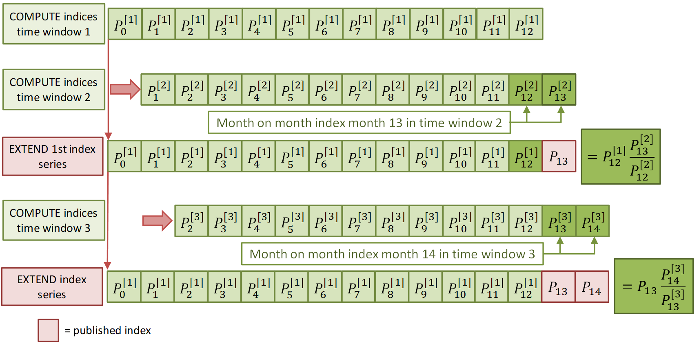
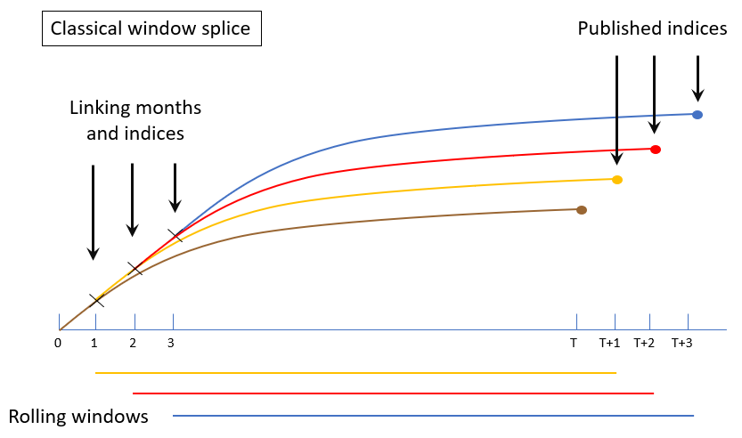
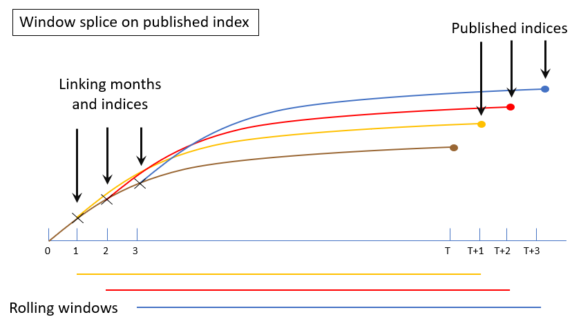
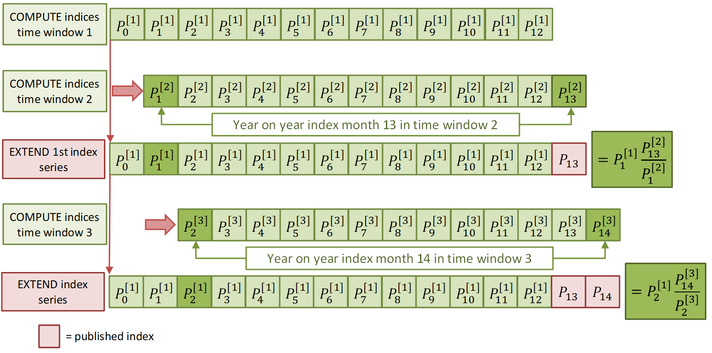
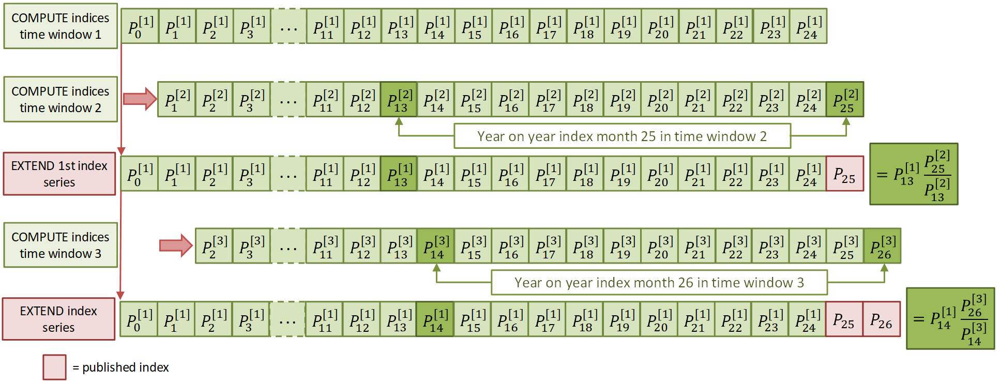
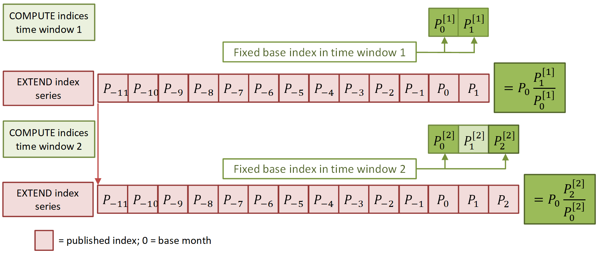
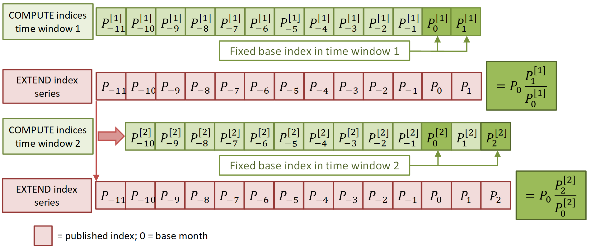

Extension methods can be used in combination with multilateral methods to ensure revision-free index series. Multilateral methods can be used to calculate price indices for each period (month) in a time interval (window). A big advantage of these methods is that the resulting indices form a transitive series, which means that such series are free of chain drift (see [Example of chain drift](example-of-chain-drift.qmd)). Transitivity can be achieved on a fixed time window. However, index series have to be extended to the next month when statistical offices receive new data. In addition, the extension of current series must be carried out in such a way that price indices that were already published are not revised, which would be impractical and undesirable for many users of consumer price statistics. Extension methods can provide revision-free index series, although it is also important to note that by their nature any series produced using these methods are no longer free of chain drift. There are a number of different extension methods that can be applied.

**Page information**

+---------------------+--------------------------------------------------------------------------------------------+
| Version             | v6                                                                                         |
+---------------------+--------------------------------------------------------------------------------------------+
| Last updated on     | 2021-12-03                                                                                 |
+---------------------+--------------------------------------------------------------------------------------------+
| Summary of changes  | Initial publication version                                                                |
+---------------------+--------------------------------------------------------------------------------------------+
| Page History        | [See here](https://unstats.un.org/wiki/pages/viewpreviousversions.action?pageId=240910490) |
+---------------------+--------------------------------------------------------------------------------------------+

------------------------------------------------------------------------

# Splicing methods {#Extensionmethods-Splicingmethods}

There are different index extension methods, which are also known as splicing methods. The most well-known methods that make use of rolling fixed-length time windows are summarized below.

## The movement splice method {#Extensionmethods-Themovementsplicemethod}

According to the movement splice method (5, 8, 9), a price index for the new month is calculated by chaining the month-on-month index for the last month of the shifted window to the index of the previous month (the last month of the previous window). The movement splice method can be described by the following recursive formula:

$P_{M S}^{0, t}=P_{M S}^{0, t-1} \cdot P_{t-T, t}^{t-1, t}$

where $P$ is any multilateral price index formula, the subscript specifies the time window and the superscript contains the period ($t$) for which the index is calculated and the linking period ($t-1$). Figure 1 below gives an illustration of the movement splice method for 13-month windows.

Figure 1: Example of how the movement splice method would work for a 13-month window.

## The window splice method {#Extensionmethods-Thewindowsplicemethod}

The window splice method proposed by Krsinich (2014) is used to calculate the price index for the new month by chaining the indices of the shifted window to the index of $T$ months ago (i.e. to the index of 12 months ago for windows of 13 months). The index series that results from the current window is linked on the last recalculated index of $T$ months ago. Price indices generated by window splice can be expressed by the following general formula:

$P_{W S}^{0, t}=P_{W S}^{0, t-1} \cdot \frac{P_{t-T, t}^{t-T, t}}{P_{t-T-1, t-1}^{t-T, t-1}}$

An illustration of the window splice method is presented in Figure 2 below. The process underlying this method is illustrated in a different way compared with the above figure for movement splice because of the greater complexity of window splice (due to the linking on recalculated indices).

Figure 2: Demonstration of the window splice method

## The half splice method {#Extensionmethods-Thehalfsplicemethod}

De Haan (2015) suggested that the link period $t_0$ should be chosen to be in the middle of the first time window and the Australian Bureau of Statistics (2016) called this the half splice method for linking the results of two time windows. In other words, according to this method, the half splice happens at $t_0 = (T+1)/2$ if $T$ is an odd integer and at $t_0=T/2$ otherwise. A recursive formula for the half splice method is as follows: 

$P_{H S}^{0, t}=P_{H S}^{0, t-1} \cdot \frac{P_{t-T, t}^{t-t_{0}, t}}{P_{t-T-1, t-1}^{t-t_{0}, t-1}}$

Also the half splice method links on the last recalculated index.

## The mean splice method {#Extensionmethods-Themeansplicemethod}

The mean splice method (Diewert and Fox, 2018) uses the geometric mean of all possible choices of splicing, i.e. all months $\{1, 2, ..., T\}$ which are included in the current window and the previous one. The general formula for the mean splice method can be written as:

$P_{G M S}^{0, t}=P_{G M S}^{0, t-1} \cdot \prod_{t_{0}=1}^{T}\left(\frac{P_{t-T, t}^{t-t_{0}, t}}{P_{t-T-1, t-1}^{t-t_{0}, t-1}}\right)^{\frac{1}{T}}$

## Splicing methods on published indices {#Extensionmethods-Splicingmethodsonpublishedindices}

Chessa (2019) suggested that there is in fact a different approach to splicing, which is to use published indices to link index series of subsequent time windows (3). Successive window shifts generate a sequence of recalculated indices alongside the initial published index in the same period. Similarly to recalculated indices, the published indices may serve as the index on which a new index series can be linked.

Linking on recalculated indices leads to published index changes that do not correspond with any of the period on period indices of the transitive series on successive time windows. Linking on recalculated indices in past periods may therefore result in serious drift, as can be observed in series calculated with window splice (3, 12). In order to control drift in the published index series over certain time intervals (e.g. over 12-month periods), the aforementioned studies recommend to link on published indices. This ensures that period to period changes in the transitive series of the time windows will be preserved in the published series, allowing to control drift to a certain extent. However, also the location of the linking period matters when linking on published indices. For instance, movement splice is an example of a method that links on published indices (i.e. on the index of the previous month), but also this method may generate considerable drift as it is basically a period on period chaining method (3, 12).

### The window splice method on published indices (WISP) {#Extensionmethods-ThewindowsplicemethodonpublishedindicesWISP}

The recursive formula for the window splice method based on published indices may be written as follows:

$P_{pub}^{0, t}=P_{pub}^{0, t-T} \cdot {P_{t-T, t}^{t-T, t}}$

An illustration of the WISP method is presented in Figure 3 and Figure 4 below. The difference between the methods can be shown here in the placement of the X linking months, which in this diagram are all on the first line in comparison to the diagram above where the linking happens on the subsequent calculated indices. 

Figure 3: Demonstration of the window splice method on published indices

Figure 4: Alternative demonstration of the window splice method on published indices

### The half splice method on published indices (HASP) {#Extensionmethods-ThehalfsplicemethodonpublishedindicesHASP}

Chessa (2019) uses the HASP method with a 25-month window, but in general any time window length can be considered in this approach. The recursive formula for the half splice method based on published indices (HASP) can be written in a similar form as for WISP:

$P_{pub}^{0, t}=P_{pub}^{0, t-t_{0}} \cdot {P_{t-T, t}^{t-t_{0}, t}}$

An illustration of the method HASP with a 25-month rolling window is shown in Figure 5.

Figure 5: Demonstration of the HASP method on published indices with a 25-month rolling window.

### The mean splice method on published indices (MESP) {#Extensionmethods-ThemeansplicemethodonpublishedindicesMESP}

The recursive formula for the mean splice method based on published indices may be written as follows (Eurostat, 2020):

$P_{pub}^{0, t}=\prod_{t_{0}=1}^{T} (P_{pub}^{0, t-t_{0}} \cdot {P_{t-T, t}^{t-t_{0}, t}})^{\frac{1}{T}}$

# Fixed base extension methods {#Extensionmethods-Fixedbaseextensionmethods}

The extension methods described above make use of rolling fixed-length time windows. The linking months are shifted along with the monthly shifts of the time windows. However, series of published indices can also be extended by fixing the linking month and by linking index series of successive time windows on the published index in the fixed linking month. Linking fixed base or direct indices on published indices in December of the previous year is a choice that is in line with common practice in the CPI and HICP. Methods that make use of this linking strategy are known as *fixed base extension methods*. There are two methods of this type, which are described below. 

## The Fixed Base Monthly Expanding Window (FBEW) method {#Extensionmethods-TheFixedBaseMonthlyExpandingWindowFBEWmethod}

The Fixed Base Monthly Expanding Window (FBEW) method (Chessa, 2016) uses a time window with a fixed base month every year (December of the previous year). The window is enlarged every month with one month in order to include information from a new month. The FBEW method starts with two months in January, extends to three months in February and reaches the full window length (13 months) in December of the present year. The method is illustrated in Figure 6 below.

Figure 6: An example of the Fixed Base Monthly Expanding Window (FBEW) method

## The Fixed Base Moving Window (FBMW) method {#Extensionmethods-TheFixedBaseMovingWindowFBMWmethod}

Lamboray (2017) considered a modification of the FBEW method by substituting the expanding window by a fixed-length rolling window, which gives rise to the so-called Fixed Base Rolling Window (FBRW) method. Also the FBRW method used a fixed base month and fixed base indices derived from the rolling windows are linked to the published indices in the fixed base month (December of the previous year in practice). The FBRW method is illustrated in Figure 7 below.

Figure 7: An example of the Fixed Base Moving Window (FBMW) method

------------------------------------------------------------------------

# References {#Extensionmethods-References}

\(1\) (ABS) Australian Bureau of Statistics. (2016). Making Greater Use of Transactions Data to Compile the Consumer Price Index, *Information Paper* 6401.0.60.003, Canberra. <https://www.abs.gov.au/ausstats/abs@.nsf/mf/6401.0.60.003>

\(2\) Chessa, A.G. (2016). A New Methodology for Processing Scanner Data in the Dutch CPI, *Eurona *1/2016, 49-69. <https://ec.europa.eu/eurostat/documents/3217494/7556543/KS-GP-16-001-EN-N.pdf/70e246de-734c-42ba-bee2-bc0b3dd97faa?t=1468230194000>

(3) Chessa, A. (2019).  A comparison of index extension methods for multilateral methods. *Paper presented at the 16th Meeting of the Ottawa Group on Price Indices, Rio de Janeiro, Brazil. *<https://stats.unece.org/ottawagroup/download/f540.pdf>

(4) Diewert, W. E., Fox, K. J. (2017). Substitution Bias in Multilateral Methods for CPI Construction using Scanner Data. *Discussion paper 17-02*, Vancouver School of Economics, The University of British Columbia, Vancouver, Canada.

(5) de Haan, J., van der Grient, H. A. (2011). Eliminating chain drift in price indexes based on scanner data. *Journal of Econometrics*, 161, 36‐46.

(6) de Haan, J. (2015).  A Framework for Large Scale Use of Scanner Data in the Dutch CPI.  *Paper presented at the 14^th^ Ottawa Group meeting, Tokyo, Japan*. <https://stats.unece.org/ottawagroup/download/f440.pdf>

(7) Eurostat (2020). Practical Guide on Multilateral Methods in the HICP (draft). European Commission.

\(8\) Ivancic, L. W.E. Diewert and K.J. Fox (2009), "Scanner Data, Time Aggregation and the Construction of Price Indexes,\" UBC Discussion paper 09-09. <https://stats.unece.org/ottawagroup/download/f275.pdf>

\(9\) Ivancic, L. W.E. Diewert and K.J. Fox (2011), "Scanner Data, Time Aggregation and the Construction of Price Indexes," *Journal of Econometrics* 161, 24--35. <https://bpb-us-e1.wpmucdn.com/sites.psu.edu/dist/c/13885/files/2014/07/Ivancic2011_Scanner-data-time-aggregation-and-the-construction-of-price-indexes.pdf>

\(10\) Krsinich, F. (2014). The FEWS Index: Fixed Effects with a Window Splice -- Non-Revisable Quality-Adjusted Price Indices with No Characteristic Information. *Paper presented at the Meeting of the Group of Experts on Consumer Price Indices*, 26-28 May 2014, Geneva, Switzerland.

\(11\) Lamboray, C. (2017). The Geary Khamis index and the Lehr index: how much do they differ. *Paper to be presented at the 15th meeting of the Ottawa Group*. <https://stats.unece.org/ottawagroup/download/f462.pdf>

\(12\) Chessa, A.G. (2021). A Comparison of Multilateral Index Extension Methods for Seasonal Items. *Paper presented at the Meeting of the Group of Experts on Consumer Price Indices, June 2021 (online)*.
