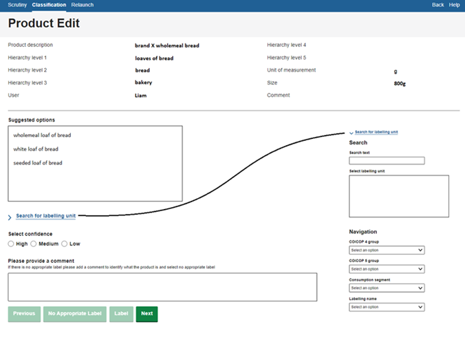

Manual classification involves each unique product being manually assigned a classification class. This is often described as labelling, and those who specialize in the task, labellers This method can also be used to validate classification done automatically by other methods. Note that labelling could also be termed annotation and labellers as annotators.

**Page information**

+---------------------+--------------------------------------------------------------------------------------------+
| Version             | v2                                                                                         |
+---------------------+--------------------------------------------------------------------------------------------+
| Last updated on     | 2025-04-28                                                                                 |
+---------------------+--------------------------------------------------------------------------------------------+
| Summary of changes  | Initial publication                                                                        |
+---------------------+--------------------------------------------------------------------------------------------+
| Page history        | [See here](https://unstats.un.org/wiki/pages/viewpreviousversions.action?pageId=337281179) |
+---------------------+--------------------------------------------------------------------------------------------+

------------------------------------------------------------------------

# Why use manual classification {#Method0Manuallabellingorvalidationofpredictedlabels-Whyusemanualclassification}

Manual classification is generally not used in datasets where the classifications can be made with very simple rules-based or keyword algorithms. These methods are simple and efficient, and therefore preferred for simple classification.

For more complex classification tasks, where products cannot be classified with simple rules, the way in which manual classification may be used depends on the scale of the classification task:

- For very small classification tasks, manual classification may require so little time to maintain that an NSO may simply choose to absorb this cost and not seek any further automation.
- For medium-sized classification tasks where manual classification takes a feasible albeit non-trivial amount of time, NSOs have some flexibility. They may choose to use manual classification in a production-setting temporarily whilst researching machine-assisted/automated techniques, or they may wait until these techniques are available before entering production.
- For extremely large classification tasks, manual classification is generally not viable in an ongoing production setting due to extremely large costs in maintaining the method on an ongoing basis. However, samples of data may still be labelled, in other words establishing a \'ground truth\' or \'golden dataset\' manually, to use for training and testing a machine learning model (1). 

Manual classification may also be done as a supporting process to support other classification work and for quality assurance:

- Manual labelling may be applied during the [iterative initial classification phase](pre-conditions-and-deciding-on-appropriate-classification-methods.qmd), i.e. as a starting place when first evaluating and developing classification methods. For instance, manually labelled datasets may be used to discover the categories or keywords that should be used when developing methods 1 or 2. 
- Manual labelling is also commonly used in production to maintain quality of the dataset that [feeds aggregation](https://unstats.un.org/wiki/spaces/GWGSD/pages/87429390/ARCHIVE+Aggregation), such as by validating all or a proportion of the data after an automated classifier has predicted what the categories should be. This is commonly described as the review and validate step in the GSBPM (or step 5.3) (2) and is necessary to mitigate possible bias due to misclassification (3). While this could apply on all the records (see [method 3](method-3-recommendation-machine-assisted-classification.qmd) for more details), if it is applied on just a proportion of the records classified (say by [method 4](method-4-machine-learning-classification-method.qmd)), then this is commonly referred to \'selective editing\'. See blending classification methods (forthcoming) for more detail on common approaches.
- Similarly to quality maintenance, data that is manually classified on a recurrent basis may be used to calculate [evaluation metrics](how-to-evaluate-classification-methods.qmd) of the performance of the classification method in production and to detect decay in performance and a need to update or retrain or redevelop advanced methods. Ritter et al (2024) showed how this is pivotal for MLOps systems (4). 

# How to apply manual classification {#Method0Manuallabellingorvalidationofpredictedlabels-Howtoapplymanualclassification}

Manual classification can be completed in several ways and in several steps:

- Preparation for manual classification is key as labelers need to follow a clear set of instructions to make sure classification is done consistently. See [Quality Considerations](#Method0:Manuallabellingorvalidationofpredictedlabels-Quality-Considerations) for more details.
- Where resources allow, NSOs may wish to test consistency of labellers by having more than one individual label the same records. Research has suggested that for less homogeneous categories, labeller consistency may be not be as high as first expected (5, 6).
- Manual classification, if done on only a sample of all the data, may also be targeted and combined with Machine Learning methods such as Active Learning. In this way, a targeted dataset may be labelled (6).

## The labelling environment {#Method0Manuallabellingorvalidationofpredictedlabels-Thelabellingenvironment}

To perform labelling, National Statistical Offices will need to make a judgement on how much time to put into the design and development of their labelling environment based on the extent to which it will be used. Alongside labelling, the environment will need to account for work allocation, quality assurance and collation of completed labelling work.

For smaller classification tasks, work could be performed within spreadsheets. This may not be ideal for prolonged use due to several quality concerns. Allocation and collation of work is likely to be manual and time-consuming. Spreadsheets will not display information in a user-friendly way by default which may mean a lot of time spent by labellers interacting with the spreadsheet to obtain the information they need. Labellers may need to manually type classes and this can cause grammatical, spelling, or case-sensitive errors which will need to be corrected as part of a quality assurance process. If labelling is done long-term, these quality issues and inefficiencies may stack up and cause costly relabelling exercises.

Alternatively, NSOs may invest into designing applications for labelling. An example of a web browser-based application developed within the Office for National Statistics (UK) is shown to the right. This bespoke approach has been designed to meet the NSOs labelling requirements:

- Information is displayed for labellers in a user-friendly way.
- Labellers select classes rather than manually typing, improving efficiency and reducing errors.
- Automatic saving avoids loss of progress through program crashes.
- Labellers can use a navigation/search menu to search through available classes.
- Offers labellers a help menu for training and advice.
- When using [machine-assisted manual classification](method-3-recommendation-machine-assisted-classification.qmd), the program displays and allows selection of machine recommendations
- The process of assigning products and collating and uploading labels is performed automatically by the back-end part of the system.

Figure 1: Overview of labelling browser-based application developed at the ONS.

# Quality considerations {#Method0Manuallabellingorvalidationofpredictedlabels-Qualityconsiderations}

Despite the lack of a specific methodology, there are still many quality aspects that come with manual classification/labelling. Several ways NSOs have of improving quality when manually labelling include:

- **Taking time to design classes**: taking the time to ensure that class descriptions are unambiguous can avoid costly relabelling exercises due to common errors being made.  
- **Defining classes at the right level of homogeneity**: classes need to be homogeneous enough for index compilation purposes, but labellers may not be able to distinguish between very homogeneous classes if the data available is not granular enough to support this split. See discussion in the [homogeneity section of the pre-conditions overview](pre-conditions-and-deciding-on-appropriate-classification-methods.qmd) for more details on selecting the level to which to classify.
- **Maintaining instructions**: labellers may sometimes come across uncommon products which they find difficult to place. By keeping and updating instructions on these situations as they occur, NSOs can ensure consistency amongst labellers.
- **Expert labelling:** labellers with field expertise in the topic they are labelling, with knowledge of what classes exist, may be able to perform classification to a higher quality.
- **Embedding quality assurance processes:** when labellers are less certain of how to place a class, it may be escalated to expert colleagues for a second opinion. Labellers can be asked to provide a "confidence score" (as shown in Figure 1) to prioritise this quality assurance.
- **Enabling comments**: by allowing labellers to leave comments on products they are unable to classify, classification teams can use word frequencies to find commonly unplaced product types.

------------------------------------------------------------------------

# References {#Method0Manuallabellingorvalidationofpredictedlabels-References}

\(1\) Machine Learning for Official Statistics, March 2022. <https://unece.org/statistics/publications/machine-learning-official-statistics>

\(2\) Spackman, W., Francis, J., Goussev, S. (2025) \"Optimal use of machine learning at scale: Designing quality control of machine learning classification and mitigating misclassification error.\" *Presented at the 2025 CPI Expert Group*. <https://unece.org/sites/default/files/2025-04/Spackman%20et%20al%20%282025%29%20-%20QC%20for%20mitigating%20misclassification%20bias%20-%20paper.pdf>

\(3\) Spackman, W., Goussev, S., Wall, M., DeVilliers, G., Chiumera, D. (2024) \"Machine Learning is (not!) all you need: Impact of classification-induced error on price indices using scanner data\" *Paper presented at the 18^th^ Meeting of the Ottawa Group. *<https://stats.unece.org/ottawagroup/download/Papers-session-8-pres-1-spackman-et-al-2024-misclassification-is-not-all-you-need.pdf>

\(4\) Ritter, C., Spackman, W., Best, T., Goussev, S., DeVilliers, G., Theobald, S. (2024) \"Adopting a high Level MLOps Practice for the Production Applications of Machine Learning in the Canadian Consumer Prices Index\" Data Science Network for the Federal Public Service. Statistics Canada. <https://www.statcan.gc.ca/en/data-science/network/high-level-mlops-practice>

\(5\) Greenhough, L. Martindale, H., Sands, H. (2022) \"Modernising the measurement of clothing price indices using web scraped data: classification and product grouping\" *Paper presented at the 17^th^ Meeting of the Ottawa Group.* <https://stats.unece.org/ottawagroup/download/f645.pdf>

\(6\) Spackman, W., DeVilliers, G., Ritter, C., Goussev, S. (2023)  Identifying and mitigating misclassification: A case study of the Machine Learning lifecycle in price indices with web-scraped clothing. *Presented at the 2023 CPI Expert Group*. <https://unece.org/sites/default/files/2023-05/2b.3%20Identifying%20and%20mitigating%20misclassification_Canada.pdf>
